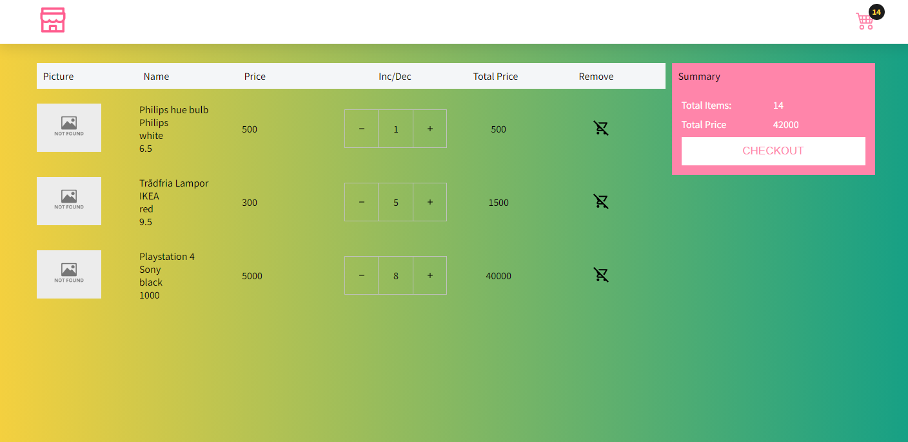

## Iran Shopping Cart


#### Installation and use

Clone this repository:

```
git clone https://github.com/mmirzaei559/iran-shopping-cart.git
```

Install npm packages:

```
npm install
```

Start working:

```
npm start
```

## Short description

### What this application does?

This is a simple shopping cart app in which you can view the goods with details and add them to the shopping cart if available. Products can also be added or removed before payment.

### What technologies are used?

React, JavaScript, TypeScript, Redux.